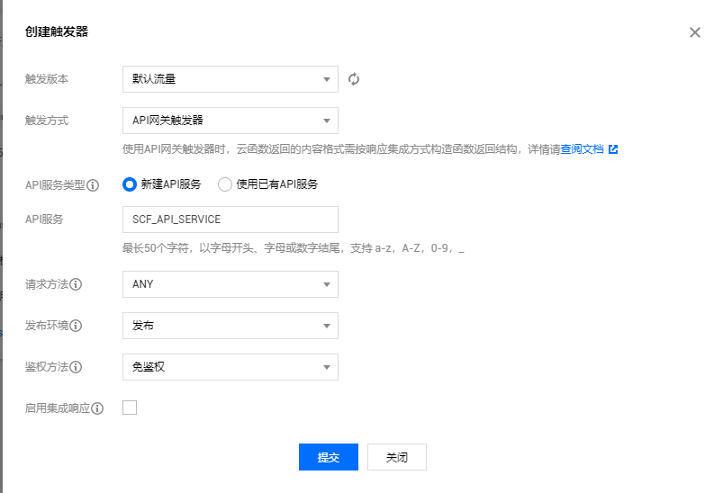

# <div align="center">Serverless 实践

**Referenece Address**: [@云函数 SCF 组件][1]

---

## Function Service:自动创建云函数

- 进入[@腾讯云][2]，新建`函数服务` - 基本信息配置
  

- 函数配置
- 触发配置
  
- 查看云函数

## Function Service:手动创建云函数

### Serverless Framework

```powershell
	npm i serverless -g
	npm update serverless
	sls -v
	serverless -v
```

### Serverless Components

- 根据 [参考地址][1] 创建目录
- 编写 yaml 文件，进行配置
- 编写.env，（访问管理-访问密钥-API 密钥管理）
- 执行命令 `sls --debug`，将 yaml 的配置发布到云上（如果没有配.env，会需要进行扫码登录，登录后自动生成.env）
- 在 `函数服务` 中可以查看部署的云函数

### API 网关组件

- 所有 API 的调用统一接入的 API 网关层
- 是用户和服务器的连接器

#### 创建

- 在`API网关-服务`创建网关
- 在本地进行创建

  1. 新建目录`tencent-api`
  2. 配置 yaml 文件
  3. `sls --debug`部署
  4. 在`API网关-服务`查看新建的网关服务

> 在新建云函数时，可以新建 API 服务也可以使用已有的 API 服务

[1]: https://cloud.tencent.com/document/product/1154/39271#2.-.E5.88.9B.E5.BB.BA
[2]: https://console.cloud.tencent.com/scf/list?rid=1&ns=default
